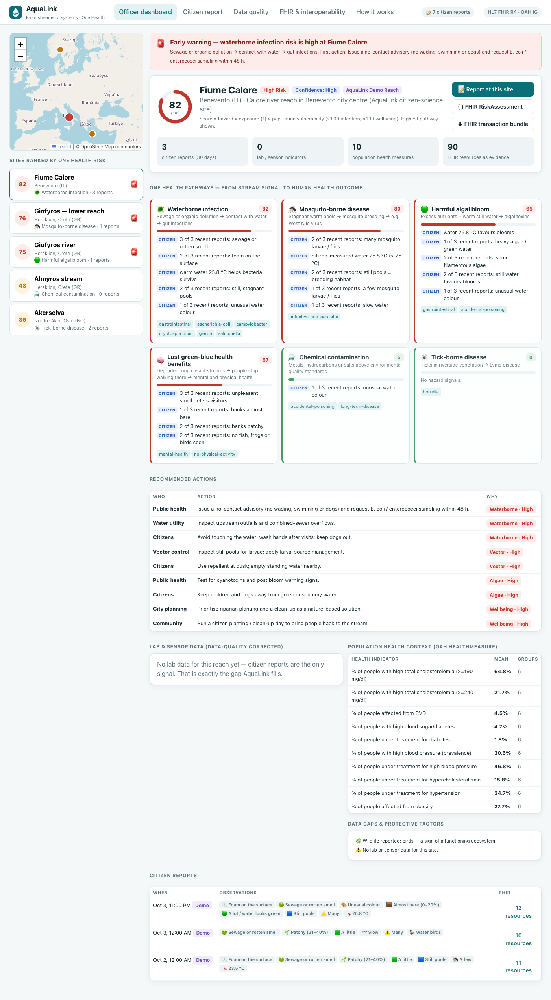
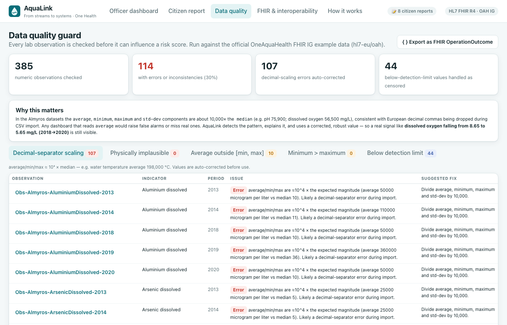
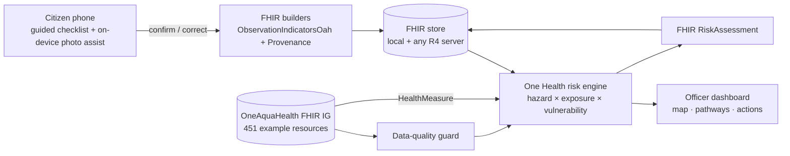

# AquaLink: from streams to systems

**Citizens already notice when a stream is sick. AquaLink turns those observations into OneAquaHealth FHIR data and One Health early warnings, so a public-health officer can act before people get sick.**

**🔗 Live demo: https://sravya1802.github.io/aqualink/**

Built for the **OneAquaHealth IEEE Global Hackathon 2026** · Primary track: **Track 7: Digital Health Standards** (also covers Tracks 1, 2, 3, 5 and 6)



---

## The problem

- Urban streams are rarely monitored. The most recent lab data in the OneAquaHealth examples for the Almyros stream is from **2020**.
- Citizen-science observations stay in ecology silos and never reach public-health systems.
- Everyone agrees ecosystem health and human health are linked (One Health), but no tool computes that link for a specific stream, today, in a format health systems understand.

## What AquaLink does

| Step | What happens |
|---|---|
| **1 · Citizen report** | A 60-second guided checklist in plain language (7 questions + optional thermometer/pH strip). Each question explains *why it matters for health*. |
| **2 · Human-in-the-loop AI** | Optional photo assist runs **on-device** (nothing uploaded). It pre-fills suggestions with a confidence and a reason; the citizen confirms or corrects each one. |
| **3 · FHIR, natively** | Every answer becomes an `ObservationIndicatorsOah` on a `LocationOah`, coded with the **OneAquaHealth IG** indicator code system. A `Provenance` records the citizen as *author* and the AI as *assembler*. |
| **4 · Data-quality guard** | Lab observations are checked before use. AquaLink found **107 observations in the official IG examples** whose statistics are scaled ~10⁴× (decimal-separator import issue) and corrects them. |
| **5 · One Health risk engine** | `risk = hazard × exposure × vulnerability` across **6 pathways**, combining citizen signals, corrected lab data, and **OAH population health measures** (Benevento, Oslo). Every point of score is traceable to evidence. |
| **6 · Early warning + action** | Sites ranked by risk, an alert banner, actions per audience (public health, utility, vector control, citizens), and a FHIR `RiskAssessment` any OAH-compatible system can consume. |

### One Health pathways

| Pathway | Stream signal → human outcome | Linked OAH health indicators |
|---|---|---|
| 🦠 Waterborne infection | sewage smell / foam / stagnant water / low dissolved oxygen / ammonium | `gastrointestinal`, `escherichia-coli`, `campylobacter`, `cryptosporidium`, `giarda`, `salmonella` |
| 🟢 Harmful algal bloom | heavy algae, phosphates, warm still water | `gastrointestinal`, `accidental-poisoning` |
| 🦟 Mosquito-borne disease | larvae, still pools, water > 20–25 °C | `infective-and-parasitic` |
| 🕷️ Tick-borne disease | ticks in dense bank vegetation | `borrelia` |
| ⚗️ Chemical contamination | metals above EU MAC-EQS, oily sheen, high conductivity | `accidental-poisoning`, `long-term-disease` |
| 🧠 Lost green-blue benefits | bare banks, no wildlife, bad smell | `mental-health`, `no-physical-activity` |

Thresholds: EU Nitrates Directive (50 mg/L), priority-substance MAC-EQS (Directive 2013/39/EU), dissolved oxygen < 5–6 mg/L, conductivity > 1500 µS/cm. Vulnerability multipliers come from chronic-disease, mental-health and obesity prevalence in OAH `HealthMeasure` observations.

## Real findings from the OneAquaHealth data

Found by running AquaLink on the official IG example data:

- **Almyros (Crete):** dissolved oxygen fell **35% (8.65 → 5.65 mg/L, 2018→2020)**, and dissolved **nickel at 49 µg/L exceeds the EU MAC-EQS of 34 µg/L** (2020).
- **Almyros:** the lab's **mercury detection limit (0.5 µg/L) is above the EU standard (0.07 µg/L)**, so results cannot rule out an exceedance. AquaLink reports this as a data gap instead of a false "all clear".
- **IG example data:** 107 observations have `average/min/max/std-dev` ≈ 10⁴ × the `median` (e.g. water temperature average **198,000 °C**). AquaLink can export these as a FHIR `OperationOutcome` for the IG maintainers.



## FHIR & interoperability

| Resource | Profile | Use |
|---|---|---|
| Observation | [`observation-indicators-oah`](https://build.fhir.org/ig/hl7-eu/oah/StructureDefinition-observation-indicators-oah.html) | Citizen indicators (foam/colour/smell, riparian vegetation, filamentous algae, hydrology, diptera, ticks, fish, amphibians, birds, water temperature, pH) |
| Observation | `observation-with-component-oah` | Lab statistics read from the IG examples |
| Observation | `observation-health-measure-oah` | Population health context |
| Location | `location-oah` | Stream reaches, linked to cities via `partOf` |
| Group | `group-oah` | Population at risk (`RiskAssessment.subject`) |
| Provenance | core R4 | Human-in-the-loop AI audit trail |
| RiskAssessment | core R4 | One prediction per pathway, outcomes coded with OAH health indicators |

- **All citizen observations pass the profile's required-element checks** (status, code, subject → Location, effective, performer, value type, component values).
- **Sync** posts an idempotent FHIR `transaction` (PUT) to any R4 server. It's tested live against the public HAPI server; you can point it at the OAH sandbox.
- **Round-trip:** `GET Observation?subject=Location/…&_tag=…|citizen-science` reads the reports back.

## Architecture



```
src/
  lib/codes.js         OAH terminology + plain-language citizen questions
  lib/fhirBuilders.js  report → Observation/Provenance, RiskAssessment, transaction bundles
  lib/dataQuality.js   plausibility, decimal-scaling, censored (below-LOD) detection
  lib/riskEngine.js    6 One Health pathways, explainable evidence, actions
  lib/photoAssist.js   on-device image heuristics (suggest-only)
  lib/validate.js      OAH profile structural checks
  lib/fhirServer.js    FHIR REST client (transaction, search, metadata)
  data/oah-bundle.json compiled from github.com/hl7-eu/oah with SUSHI
scripts/build-data.mjs rebuilds the dataset from the IG
tests/                 vitest suite (data quality, FHIR conformance, risk engine)
```

## Run it

```bash
npm install
npm run dev      # http://localhost:5173
npm test         # 9 tests
npm run build
```

Rebuild the dataset from the latest IG:

```bash
git clone https://github.com/hl7-eu/oah.git && (cd oah && npx fsh-sushi .)
OAH_IG_DIR=./oah node scripts/build-data.mjs
```

## Honesty notes

- **Demo data:** the Calore (Benevento) and Akerselva (Oslo) reaches and 7 citizen reports are synthetic demo data. They are tagged `aqualink-demo` / `synthetic-demo` in FHIR and labelled "Demo" in the UI. All lab and health data is the official OAH IG example data.
- **Photo assist:** colour heuristics, not a trained model. That's why it only suggests, shows its reasoning, and needs human confirmation. A trained model (e.g. for macroinvertebrates) can plug in behind the same interface.
- **Risk scores:** decision support, not diagnoses. Confidence is shown, and drops when evidence is thin.

## Scaling to every OneAquaHealth city

AquaLink has no custom API. Any city that publishes OAH-profiled FHIR data gets citizen science, data-quality checks and One Health early warnings by changing one URL. The engine is pure client-side JavaScript, so it can run as a PWA alongside the existing OAH Citizen Science App, or its rules can run server-side as a FHIR subscription.

## Team

Built during the hackathon (Sept 16 – Oct 4, 2026). Data © the OneAquaHealth project / HL7 Europe (hl7-eu/oah). Map tiles © OpenStreetMap contributors.

## License

MIT
